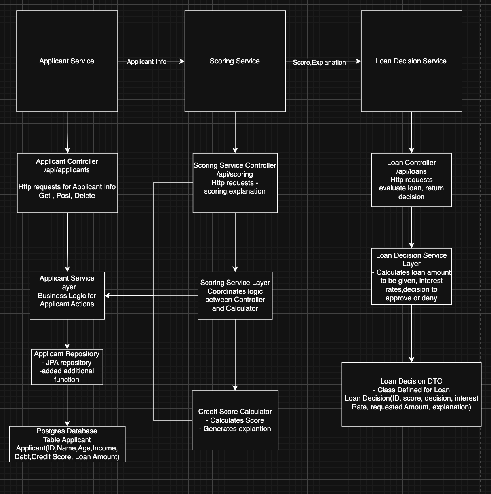

# Credit Risk Assessment System

This backend simulates how loan decisions are made when people apply for a loan at a bank. Using configurable scoring weights and applicant inputs, the system computes a credit score and returns a loan decision: approved or denied.

## Overview

The backend provides a REST API and is organized into three core services:

- **Applicant Service**: Manage loan applicants and their information using CRUD operations.
- **Scoring Service**: Calculate a credit score for an applicant using a scoring algorithm and provide explanations for the score components.
- **Loan Service**: Produce a loan decision (approve/deny) based on the scoring service and applicant data.

## Features

- Create, read, update, and delete applicants
- Calculate credit scores and return scoring explanations
- Evaluate loan decisions based on calculated scores and applicant data
- Lightweight health endpoints for quick service checks
  
## How it all connects - Controller-Service-Repository Pattern


## Tech Stack

- Java 17 (or compatible)
- Spring Boot
- Postgresql
- Maven
- Docker / Docker Compose (optional)

## Project Structure

- `src/main/java` — Application source code (controllers, services, models)
- `src/main/resources/application.yml` — Application configuration
- `pom.xml` — Maven configuration
- `docker-compose.yml` — Optional multi-container setup

## Prerequisites

- JDK 17 or higher
- Maven (if not using the bundled `mvnw` wrapper)
- Docker & Docker Compose (optional, for containerized run)

## Build & Run

Run with the included Maven wrapper:

```bash
./mvnw clean package
./mvnw spring-boot:run
```

Or build and run the generated jar:

```bash
./mvnw clean package
java -jar target/*.jar
```

To run using Docker Compose (if you want to containerize):

```bash
docker-compose up --build
```

## Running Tests

Run unit tests with:

```bash
./mvnw test
```

## API Endpoints

The main API endpoints exposed by the application are listed below. All endpoints are JSON-based.

- **Health**
  - `GET /health` — returns a simple status map for the application (status, message)

- **Applicants** (`/api/applicants`)
  - `POST /api/applicants` — Create a new applicant. Provide an applicant JSON in the request body.
  - `PUT /api/applicants/id/{id}` — Replace (update) an applicant by id. Provide full applicant JSON.
  - `PATCH /api/applicants/id/{id}` — Partially update an applicant. Provide a JSON map of fields to update.
  - `GET /api/applicants` — Retrieve all applicants.
  - `GET /api/applicants/id/{id}` — Retrieve a single applicant by id.
  - `GET /api/applicants/name/{name}` — Retrieve an applicant by name.
  - `DELETE /api/applicants/id/{id}` — Delete an applicant by id.
  - `DELETE /api/applicants/delete-all` — Delete all applicants.

- **Scoring** (`/api/scoring`)
  - `GET /api/scoring/calculate/{applicantId}` — Calculate and return the numeric credit score for the applicant.
  - `GET /api/scoring/explanation/{applicantId}` — Return a human-readable explanation of how the score was computed.
  - `GET /api/scoring/health` — Health check for the scoring service.

- **Loans** (`/api/loans`)
  - `GET /api/loans/{id}` — Evaluate a loan for the applicant with the given id and return a `LoanDecision`.

### Example CURL

Create applicant :

```bash
curl -X POST http://localhost:8080/api/applicants \
  -H "Content-Type: application/json" \
  -d '{
  "name": "John",
  "age": 40,
  "income": 120,000,
  "debt": 20,000,
  "creditScore": 700,
  "loanAmount": 15,000,
  "monthsEmployed": 15,
  "monthlyDebtPayments": 500,
  "residentMonths": 12
}'
```

Calculate score:

```bash
curl http://localhost:8080/api/scoring/calculate/1
```

Evaluate loan:

```bash
curl http://localhost:8080/api/loans/1
```


